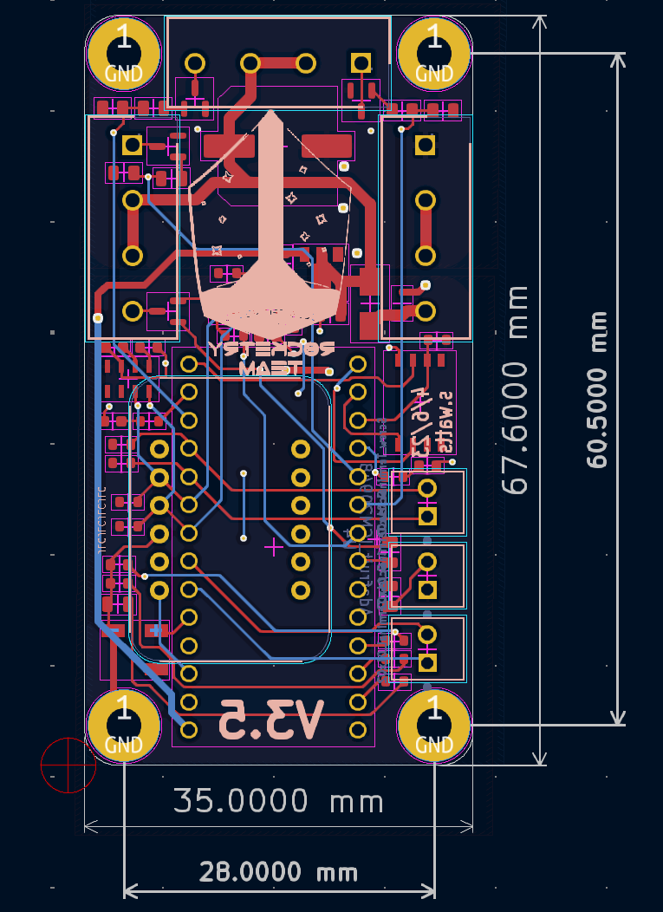
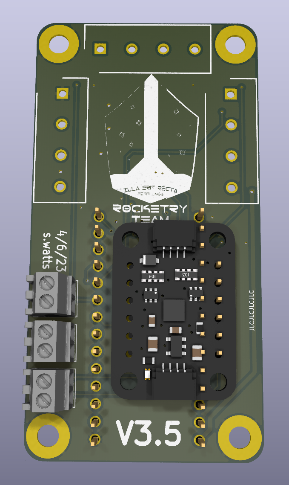
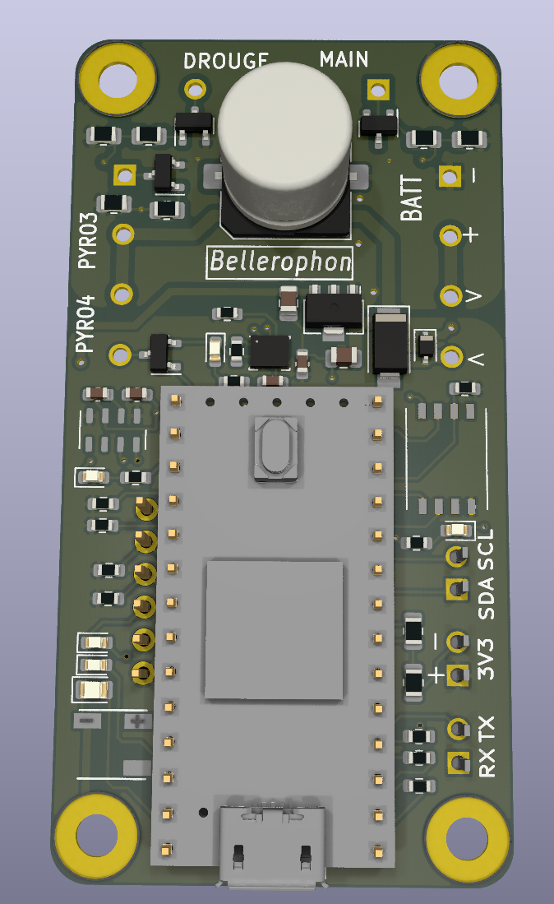
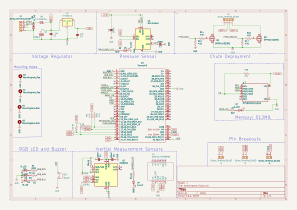

# hardware
Pronounced: BE-LLER-O-FIN

Pyro-capable Flight Computer with a pressure sensor and IMU. Designed to be general purpose and small enough to fit inside any rocket. Originally developed for UNSW Rocketry Team. 

**PARTS LIST:**

- Microprocessor: Teensy 4
- Barometer/Altimeter: MPL3115A2
- Inertial Measurement Unit (IMU): LSM6DS3
- Memory: XTSD 4GB NAND Flash
- Secondary IMU (optional): Adafruit ICM20948 Breakout Board
- PWM Buzzer
- Individual R, G, B Leds + dedicated programmable LEDs for Barometer, IMU and Flash

---

## 📸 Overview

### 📐 PCB Layout

**Dimensions**: 35.0 mm × 67.6 mm  
**Mounting Holes**: ⌀3.2 mm (4-cornered)

---

### 🔧 Render – Back Side (Component View)

---

### ⚙️ Render – Front Side (Sensor & Output Side)

---

## 📊 Schematic

Includes overcurrent protection, sensor routing, pyro switching, and regulator design for 3.3V and 5V rails.

---

